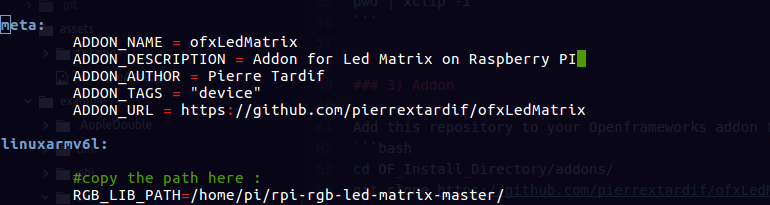
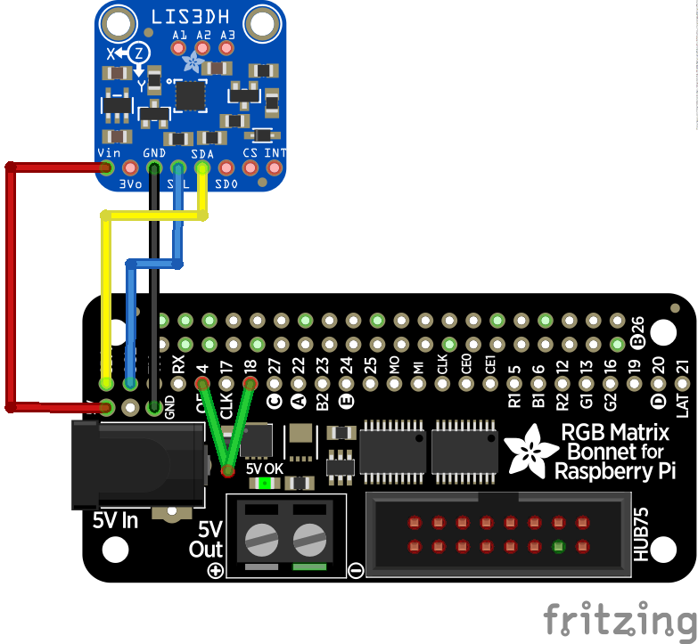

# ofxLEDMatrix

Repository to adapt [this library](https://github.com/hzeller/rpi-rgb-led-matrix/) into [Openframeworks](https://openframeworks.cc).
 </br> The goal is to use the [Adafruit Leds Matrix](https://www.adafruit.com/product/3649) & [bonnet](https://www.adafruit.com/product/3211) with [Openframeworks](https://openframeworks.cc) on [raspberry-Pi 3 model B+](https://www.raspberrypi.org/).
</br>

- - - -


- - - -
## Getting Started

### List of Material
| item  | link |
| ------------- | ------------- |
| Raspberry pi 3 model B+  |https://www.raspberrypi.org/products/raspberry-pi-3-model-b-plus/  |
| Matrix Bonnet | https://www.adafruit.com/product/3211 |
| Matrix of Leds | https://www.adafruit.com/product/3649 |
|SDCard | [amazon link](https://www.amazon.co.uk/SanDisk-microSDHC-Memory-Adapter-Performance/dp/B073K14CVB/ref=asc_df_B073K14CVB/?tag=googshopuk-21&linkCode=df0&hvadid=309785494452&hvpos=1o1&hvnetw=g&hvrand=777039086894976690&hvpone=&hvptwo=&hvqmt=&hvdev=c&hvdvcmdl=&hvlocint=&hvlocphy=1006886&hvtargid=pla-374265929034&psc=1&th=1&psc=1) |
|Power Supply | https://www.adafruit.com/product/1466 |


### Installs

### 1)Installing OpenFrameworks

Get the latest OpenFrameworks version from [here](https://openframeworks.cc/download)(linux armV6), and follow [this tutorial](https://openframeworks.cc/setup/raspberrypi/) to get set up with the openframeworks on raspberry Pi.
</br>
Make sure you can run some of the examples before proceeding any further (for example : OF_Install_Directory/examples/3DPrimitivesExample/).

### 2) Installing

Get the latest version of the rpi-rgb-led-matrix from [here](https://github.com/hzeller/rpi-rgb-led-matrix/).
</br>
Follow the tutorial on the readme page from the [Let's do it section](https://github.com/hzeller/rpi-rgb-led-matrix/#lets-do-it).
</br>
Make sure you can run a demo from the [example-api-use section](https://github.com/hzeller/rpi-rgb-led-matrix/tree/master/examples-api-use).
</br>
Just
```bash
cd example-api-use
make
sudo ./demo

```

[Make a note of the path](#path-link) to the root directory of the rpi-rgb-led-matrix :
```bash
#from the root directory of the rpi-rgb-led-matrix repo :
pwd
#gives me : /home/pi/rpi-rgb-led-matrix-master
#copy into the clipboard:
# install xclip : sudo apt-get install xclip
pwd | xclip -i
```


### 3) Addon

Add this repository to your Openframeworks addon folder in :
```bash
cd OF_Install_Directory/addons/
git clone https://github.com/pierrextardif/ofxLedMatrix
```
Then change the path of the addons.make using the path copied [earlier](README.md#path-link):
```bash

cd ofxLEDMatrix/
sudo nano addon_config.mk
```
Replace

RGB_LIB_PATH with the path copied.

## Example

Just try running [the example](./example).

### Testing on other machine

Try copying the example on an other (more powerful) machine and running it, transforming the line :
```cpp
//#define COMPUTERWORK
```
into
```cpp
#define COMPUTERWORK
```
so the graphics can be worked on, on a faster machine ( compilation), then uploaded on the PI.

### Use the Lis3dh

[The example](https://learn.adafruit.com/matrix-led-sand) given by adafruit includes [an accelerometer](https://www.adafruit.com/product/2809).
</br>
In order to use it I have included the code they have used in their example and mapped it to the movements of the [ofEasyCam](https://openframeworks.cc/documentation/3d/ofEasyCam/) for zooming in/out.

#### Wiring

You can wire the acelerometer using this diagram :


## Author

* _pierre Tardif_   [codingcoolsh.it](codingcoolsh.it)   :floppy_disk:

## License

This project is licensed under the MIT License - see the [LICENSE.md](./LICENSE) file for details.


## Acknowledgments

* [Adafruit Tutorial](https://learn.adafruit.com/matrix-led-sand)
* [Henner Zeller](https://github.com/hzeller)

## Next
</br>
Adding the libray precompiled straight into the `/lib` folder of the repo (no external install).
