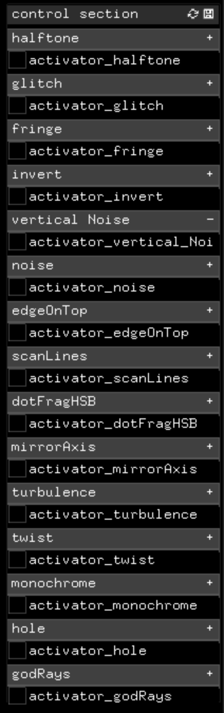

# ofxAVPostProcessing

Repository to create a local addon for postProcessing visual effects.


addons.make should look like this :
``` cpp
../local_addons/ofxAVPostProcessing
```

</br>

- - - -





- - - -

## Description

#### Components

The effects shaders are :
```cpp

//ofxPostProcessing
bloom (not there yet)
godrays

//dotFrag
Delay (removed but was in this [commit](https://github.com/pierrextardif/ofxAVPostProcessing/commit/d410ddca2bef8917a3ba58ce497674ad7c87da29) ( too heavy to use because of the 5 fbos))
HSB
MirrorAxis ( with duplicated "matter" mirrored content at the back)
Turbolence
Twist
Monochrome

//personal shaders (ofxKsmrFragmentFx, THREE.JS & custom)
Invert
Glitch
Vertical noise
noise
edgeOnTop
fringe
halftone
hole
```

### Structure
The addon works with ofxGUI, that's the only dependency. It has been added as a local addon in order to get the exact same version.

The structure of the addon uses only one big shader, so no buffer swap.
I believe this is more effective, as I have tried to get the buffer swap to work, but it was giving me artefacts in the middle of the screen when using more than 8 shaders...


So the mainShader is structured with 3 main type of openGL functions :

* UV coordinates modifications
* individual UV coordinates offset per channel ( like Glitch or fringe)
* color change

I created an ``` rgbFromOffset ``` function which samples a texture and returns the color depending on the offset of each channel.

The rest is classic.


## Getting Started

Add this to your local addon folder.
</br>
Try the example.

## Author

* _pierre Tardif_   [codingcoolsh.it](codingcoolsh.it)   :floppy_disk:

## License

This project is licensed under the MIT License - see the [LICENSE.md](./LICENSE) file for details.


## Acknowledgments

* [ofxKsmrFragmentFx](https://github.com/loveandsheep/ofxKsmrFragmentFx)
* [Three.js](https://threejs.org/)
* [Neil Mendoza](https://github.com/neilmendoza/ofxPostProcessing)
* [Nicola Pisenti](https://github.com/npisanti/ofxDotFrag)
