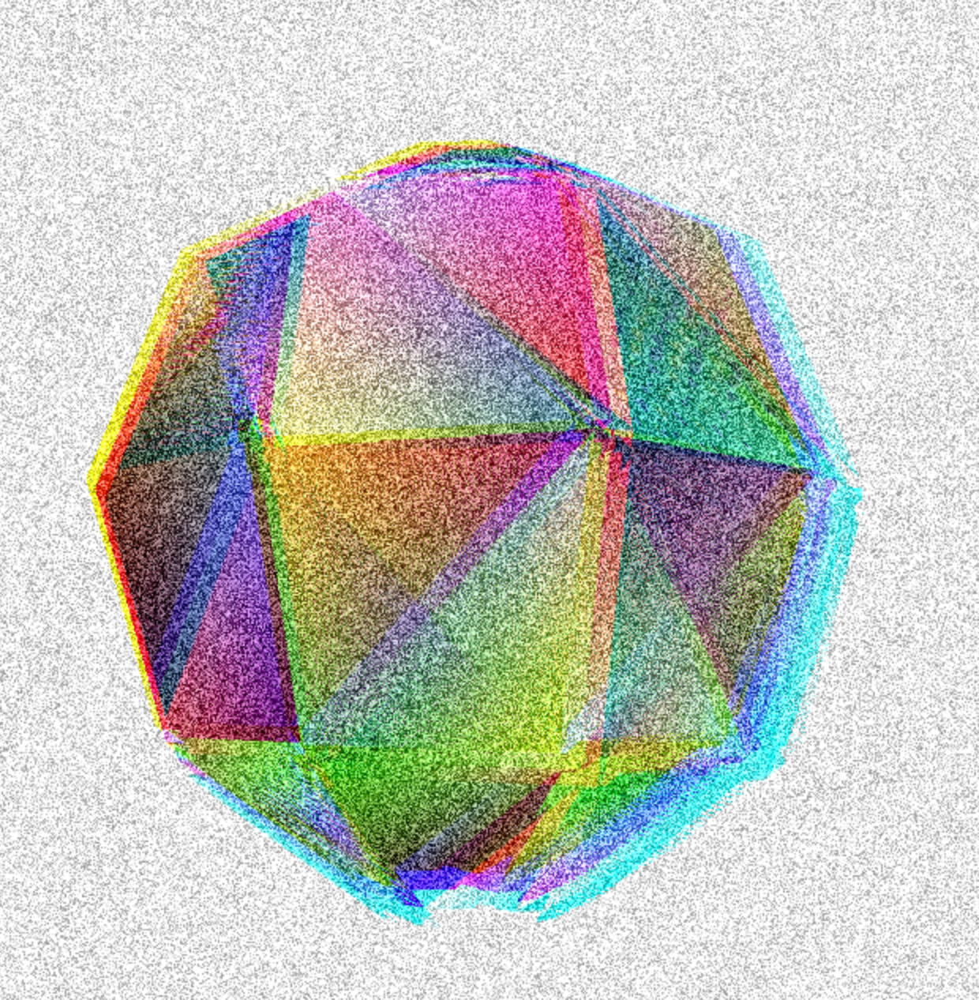

# ofxAVPostProcessing

Repository to create a local addon for postProcessing visual effects.


addons.make should look like this :
``` cpp
../local_addons/ofxAVPostProcessing
```

</br>

- - - -



- - - -
## Getting Started

Add this to your local addon folder.
</br>
Try the example.

## Author

* _pierre Tardif_   [codingcoolsh.it](codingcoolsh.it)   :floppy_disk:

## License

This project is licensed under the MIT License - see the [LICENSE.md](./LICENSE) file for details.


## Acknowledgments

* [ofxKsmrFragmentFx](https://github.com/loveandsheep/ofxKsmrFragmentFx)
* [Three.js](https://threejs.org/)
* [Neil Mendoza](https://github.com/neilmendoza/ofxPostProcessing)
* [Nicola Pisenty](https://github.com/npisanti/ofxDotFrag)
